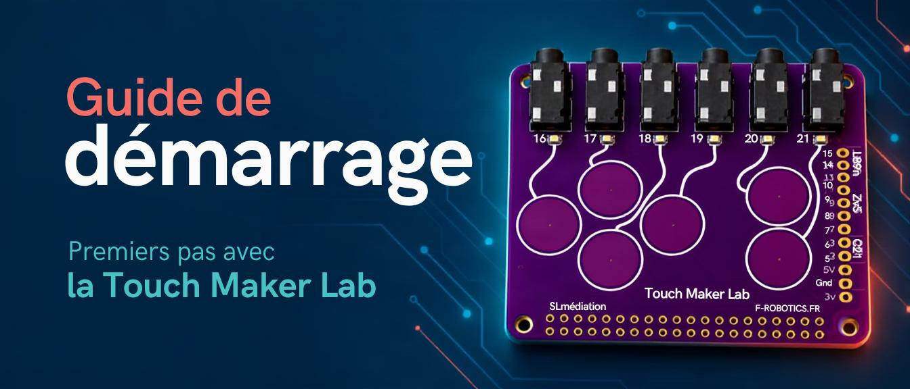

> ***« Un projet pensé par des Makers, pour des Makers ! »***

La Touch Maker Lab est née d’un constat fait au fil de nos projets : les idées sont nombreuses, mais les câbles et les branchements peuvent rapidement freiner l’expérimentation.

Nous avons donc imaginé une carte qui facilite les connexions afin de laisser plus de place à la créativité et à la programmation.

Les pads tactiles de la Touch Maker Lab permettent de créer des interfaces interactives, tandis que ses connecteurs jack facilitent le raccordement de boutons et de nombreux autres composants.

Pensée en premier lieu pour réaliser des projets de programmation créative avec Scratch, la Touch Maker Lab peut également être utilisée pour développer des projets en Python.

---

**Des ressources pour démarrer… et continuer**

Sur [touchmakerlab.fr](https://touchmakerlab.fr/) vous trouverez des programmes Scratch et Python, des fiches projets et différentes ressources pour prendre en main la carte.

Cette collection s’enrichira progressivement de nouvelles idées et réalisations.


---

**À vous de faire vivre le projet !**

La Touch Maker Lab est un projet pensé pour être partagé. Vous avez créé un jeu, une installation interactive ou un objet original ? Nous serons heureux de découvrir votre réalisation et, avec votre accord, de la faire connaître à la communauté.

---

# Guide de démarrage

**De l’installation aux premiers projets en moins d’une heure !**

## Introduction

La Touch Maker Lab est une carte d’extension pour Raspberry Pi conçue pour faciliter la découverte de la programmation physique.

Grâce à ses pads tactiles et à ses connecteurs jack, elle permet de créer rapidement des interactions entre un programme Scratch ou Python et des éléments physiques : boutons, LED et autres composants électroniques.

Ce guide vous accompagne de l’installation de la carte jusqu’à la création d’un premier jeu Scratch.

### Ce guide vous permet de…

- Installer et tester la Touch Maker Lab.
- Préparer Scratch.
- Transformer la Touch Maker Lab en manette de jeu.
- Programmer les LED témoins.
- Poursuivre avec les ressources téléchargeables.

### Ce qu’il vous faut

| Dans la boîte | Avant de commencer |
| --- | --- |
| La boîte contient la Touch Maker Lab et un lien d’accès aux ressources.<br><br>Le Raspberry Pi, son alimentation et les périphériques ne sont pas fournis. | Prévoyez un Raspberry Pi compatible, déjà configuré et fonctionnel, avec :<br><br>☐ Un support de démarrage contenant Raspberry Pi OS.<br>☐ Une alimentation adaptée à votre modèle.<br>☐ Un écran, un clavier et une souris. |

Si votre Raspberry Pi n’est pas encore configuré, reportez-vous à la [documentation officielle](https://www.raspberrypi.com/documentation/computers/getting-started.html).

L’installation du système relève du Raspberry Pi. Les étapes suivantes concernent uniquement la Touch Maker Lab.


## Installer la Touch Maker Lab

La Touch Maker Lab se place au-dessus du Raspberry Pi et se connecte directement à ses broches GPIO.

> **⚠️ Avertissement de sécurité ⚠️**
>
> Effectuez impérativement cette manipulation avec le Raspberry Pi éteint et l’alimentation débranchée.

1. Arrêtez complètement le Raspberry Pi, puis débranchez son alimentation.
2. Placez la Touch Maker Lab au-dessus du Raspberry Pi en alignant le connecteur situé sous la carte avec l’ensemble des broches GPIO.
3. Enfoncez-la délicatement, bien droit et sans forcer.
4. Vérifiez qu’aucune broche n’est décalée avant de rebrancher l’alimentation.

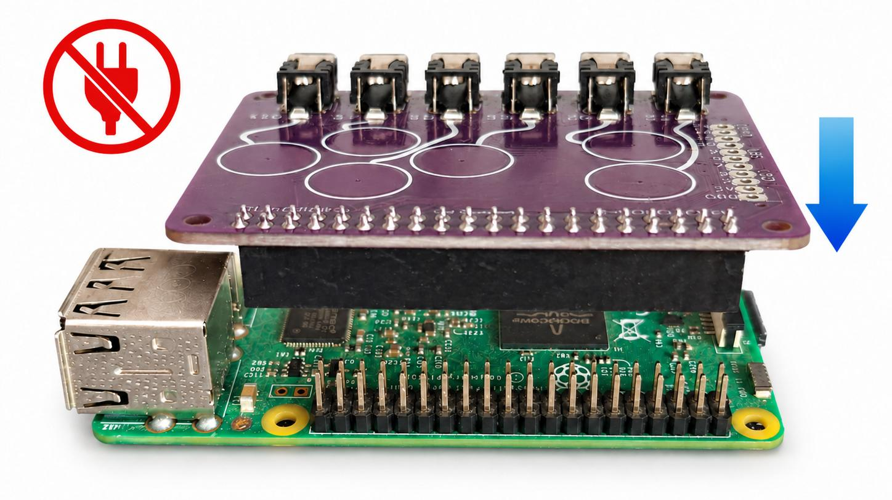

Pour stabiliser l’ensemble, vous pouvez ajouter quatre entretoises M2.5 x 11mm = vis.

### Repérer les éléments sur la carte

Sur la Touch Maker Lab, repérez les pads tactiles, les LED intégrées et les prises jacks pour les branchements externes.

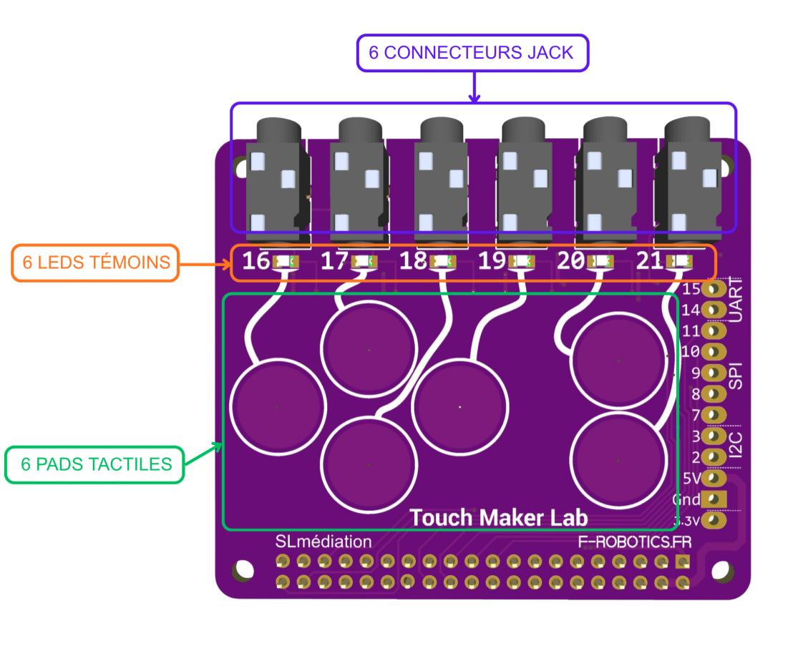

### Premier test : toucher les pads

Vous n’avez rien à connecter aux prises jack pour effectuer le premier test. Et il ne nécessite pas de charger un programme

1. Branchez l’alimentation et laissez démarrer le Raspberry Pi.
2. Touchez un pad tactile et observez la LED associée s’allumer.
3. Recommencez avec les autres pads.

> **Dépannage**
>
> Si une LED ne réagit pas, éteignez le Raspberry Pi et débranchez son alimentation avant de vérifier le positionnement de la carte.

## Préparer Scratch

Pour programmer les pads tactiles et les LED, ouvrez Scratch 3 installé sur le Raspberry Pi.

Ne passez pas par le site Scratch dans un navigateur : les extensions qui permettent d’utiliser les broches GPIO sont intégrées à la version prévue pour Raspberry Pi.

Selon la version de Raspberry Pi OS installée, Scratch peut déjà figurer dans le menu des applications.

Si Scratch n’est pas installé, deux possibilités :

- Dans le menu du Raspberry Pi, ouvrez **Préférences → Logiciels recommandés**, puis recherchez Scratch 3.
- Ou procédez à l’installation depuis le Terminal.

| Terminal | Résultat attendu |
| --- | --- |
|  | Mise à jour des paquets. |
| 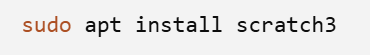 | Installation de Scratch 3. |

```bash
sudo apt update
sudo apt install scratch3
```

Une connexion à Internet est nécessaire pour l’installation.

### Les extensions Scratch pour Raspberry Pi

 Dans Scratch, cliquez sur **Ajouter une extension** en bas à gauche.

Deux extensions permettent de communiquer avec les broches GPIO utilisées par la Touch Maker Lab.

#### Raspberry Pi Simple Electronics

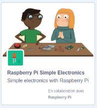

Cette extension propose des blocs pour détecter une entrée, un bouton, et commander une LED. C’est l’extension utilisée pour les premiers essais de ce guide.

#### Raspberry Pi GPIO

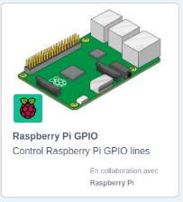

Cette extension donne accès à un contrôle plus direct des broches GPIO. Elle sera utile pour certains projets et utilisée dans le deuxième guide qui vous est proposé pour aller plus loin.

### Tester la communication

La carte réagit au toucher : vérifions maintenant qu’un pad peut déclencher une action dans Scratch.

1. Sélectionnez **Raspberry Pi Simple Electronics**. Une nouvelle catégorie de blocs apparaît dans Scratch.
2. Reproduisez le programme ci-dessous.

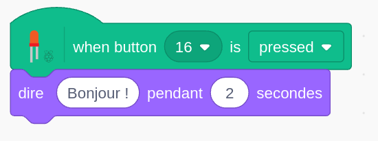 

## Transformer la Touch Maker Lab en manette de jeu

### Remplacer les touches du clavier par les pads

Les touches du clavier sont souvent utilisées dans Scratch pour déplacer un sprite ou déclencher une action. Avec la Touch Maker Lab, vous pouvez les remplacer par les pads tactiles.

Dans les exemples proposés, quatre pads servent à diriger le sprite :

| Touche du clavier remplacée | Pad tactile | Action |
| --- | --- | --- |
| Flèche gauche | 16 | Aller à gauche |
| Flèche haut | 17 | Aller vers le haut |
| Flèche bas | 18 | Aller vers le bas |
| Flèche haut | 19 | Aller vers le haut |

Le pad **21** peut, par exemple, remplacer la barre d’espace pour effectuer une action complémentaire : sauter, tirer, valider une réponse ou lancer un objet.

### Déplacer le sprite

Voici deux programmes permettant de déplacer un sprite avec les pads. Ils utilisent tous les deux l’extension Raspberry Pi Simple Electronics, mais reposent sur deux méthodes différentes.

- **Blocs événements** : déclencher un déplacement à chaque touche.
- **Conditions dans une boucle** : obtenir un déplacement continu.

Dans les deux cas, lorsque Scratch détecte qu’un pad est touché, le sprite s’oriente dans la direction correspondante, puis avance.

Vous pouvez reproduire les programmes présentés ci-dessous ou télécharger les fichiers prêts à lancer :

**Programme** `SE_Déplacement_Instructions.sb3`

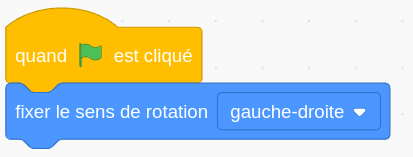

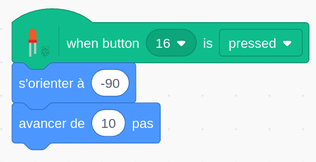 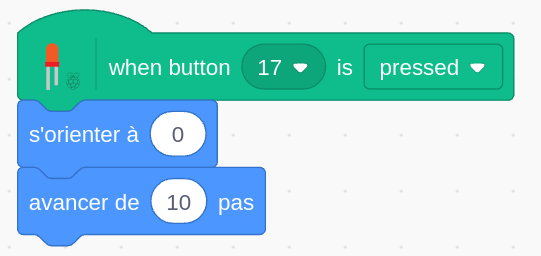

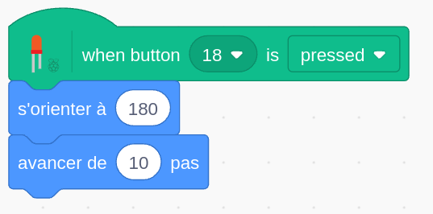 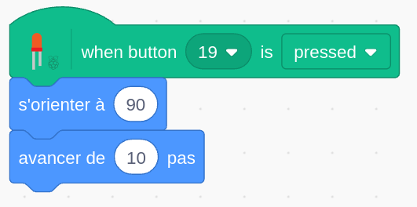

**Programme** `SE_Déplacement_Conditions.sb3`

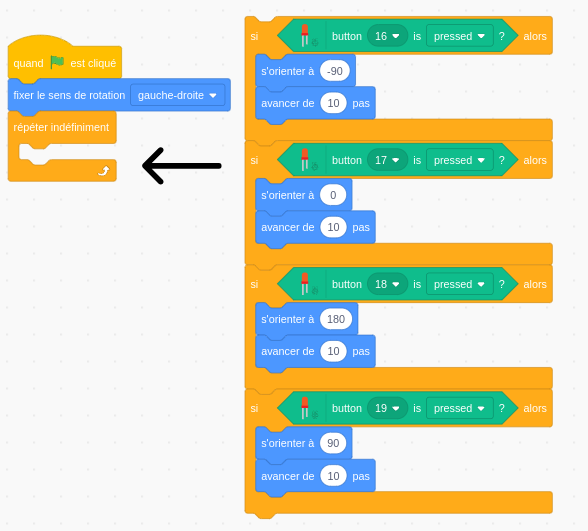

### Pour aller plus loin

Vous avez déjà créé un projet Scratch utilisant les touches du clavier ? Adaptez-le pour transformer la Touch Maker Lab en manette de jeu !

1. Repérez les blocs qui réagissent aux touches du clavier.
2. Remplacez-les par les blocs équivalents de l’extension **Raspberry Pi Simple Electronics**.
3. Testez votre projet avec les pads tactiles.

## Comprendre les LED témoins

La Touch Maker Lab possède six LED témoins, associées aux GPIO 16 à 21.

Lorsque vous touchez un pad, la LED correspondante s’allume automatiquement. Ce premier fonctionnement ne nécessite aucune programmation.

### Un fonctionnement inversé

Lorsque les LED témoins sont pilotées par Scratch, leur fonctionnement est inversé

| État choisi | État de la LED témoin | Bloc |
| --- | --- | --- |
| **ON** | LED éteinte | 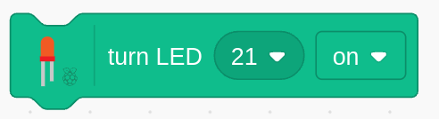 |
| **OFF** | LED allumée | 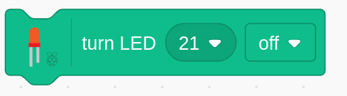 |

> **À retenir**
>
> Ce fonctionnement inversé est normal. IL correspond à la conception électronique de la carte et au rôle de ces LED.

### Allumer et éteindre une LED témoin

Dans cet exemple, nous allons commander la LED témoin associée au **GPIO 16** avec deux touches du clavier :

- La touche [A] allume la LED.
- La touche [Z] éteint la LED.

Le programme comporte trois parties :

| Blocs | Explication |
| --- | --- |
| 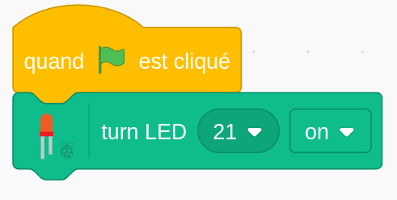 | Lorsque le drapeau vert est cliqué, placez la LED 16 sur ON afin qu’elle soit éteinte au démarrage. |
| 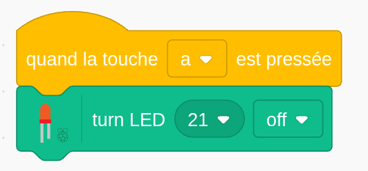 | Lorsque la touche **A** est pressée, placez la LED 16 sur OFF pour l’allumer. |
| 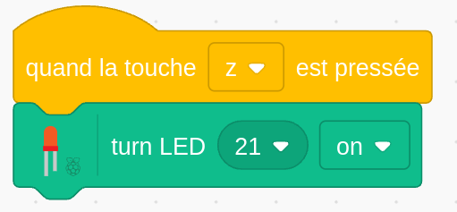 | Lorsque la touche **Z** est pressée, placez la LED 16 sur ON pour l’éteindre. |

**Programme** `SE_Interrupteur.sb3`

Modifiez le numéro du GPIO dans les blocs pour commander une autre LED témoin : 17, 18, 19, 20 ou 21.

### Programmer un chenillard

Un chenillard est une animation lumineuse dans laquelle plusieurs LED s’allument les unes à la suite des autres, puis s’éteignent. Les six LED témoins de la Touch Maker Lab permettent de réaliser facilement cet effet, sans ajouter de composants.

1. Téléchargez le programme `SE_Chenillard.sb3`
2. Ouvrez Scratch, puis importez le programme.
3. Appuyez sur la touche [Espace] pour lancer l’animation.
4. Observez le programme :
   - Les six LED sont d’abord initialisées sur ON afin qu’elles soient éteintes.
   - Chaque LED passe ensuite sur OFF pour s’allumer.
   - Une courte pause sépare chaque changement d’état.
   - Les LED repassent sur ON pour s’éteindre.
5. Modifiez la durée des pauses pour accélérer ou ralentir le chenillard.

---

## À vous de créer !

Vous savez maintenant installer la Touch Maker Lab ; vérifier son fonctionnement ; utiliser ses pads tactiles avec Scratch. Vous avez également découvert comment programmer les LED témoins et créer une première animation lumineuse.

Pour poursuivre vos expérimentations, téléchargez les projets et leurs fiches programmes.

> **Ressources et téléchargements**
>
> - [Site de la Touch Maker Lab](https://touchmakerlab.fr/)
> - [Télécharger les projets et les ressources](https://drive.google.com/drive/folders/1ErLDV3NABJdPX6h6AkegQPzbO7ecrQtf?usp=sharing)
> - [Consulter le dépôt GitHub](https://github.com/FredJ21/TouchMakerLab/)
